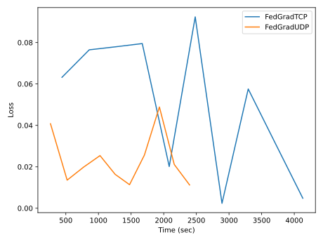
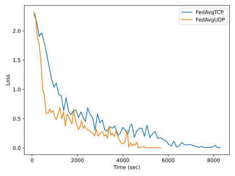
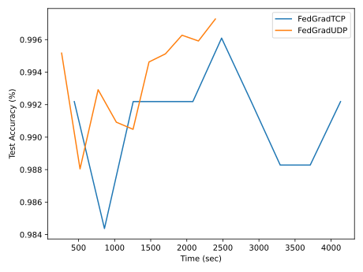
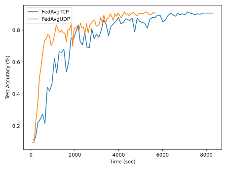

  [![Contributors][contributors-shield]][contributors-url] [![Forks][forks-shield]][forks-url] [![Stargazers][stars-shield]][stars-url] [![Issues][issues-shield]][issues-url] [![MIT License][license-shield]][license-url] [![LinkedIn][linkedin-shield]][linkedin-url]

<!-- PROJECT LOGO -->
<br />

<p align="center">
  <h2 align="center">Federated learning over WiFi: Should we use TCP or UDP?</h2>
  <p align="center">
    <a href=https://github.com/vineeths96/Federated-Learning><strong>Explore the repository»</strong></a>
    <br />
    <a href=https://osf.io/tuz6c>View Paper</a>
  </p>


</p>

> tags : distributed optimization, large-scale machine learning, edge learning, federated learning, deep learning, pytorch 


### Code for the paper [Federated learning over WiFi: Should we use TCP or UDP?](https://osf.io/tuz6c).


<!-- ABOUT THE PROJECT -->

## About The Project

Federated learning is a distributed learning paradigm where a centralized model is trained on data distributed over a large number of clients, each with unreliable and relatively slow network connections. The client connections typically have limited bandwidth available to them when using networks such as 2G, 3G, or WiFi. As a result, communication often becomes a bottleneck. Currently, the communication between the clients and server is mostly based on TCP protocol. In this paper, we explore using the UDP protocol for the communication between the clients and server. In particular, we present UDP-based aggregation algorithms for federated learning. We propose FedGradUDP for gradient aggregation-based federated learning and FedAvgUDP for model aggregation-based federated learning. We also present a scalable framework for practical federated learning. We empirically evaluate the performance of FedGradUDP by training a deep convolutional neural network on the MNIST dataset and FedAvgUDP by training VGG16 deep convolutional neural network on the CIFAR10 dataset. We conduct experiments over WiFi and observe that the UDP-based protocols can lead to faster convergence than the TCP-based protocol -- especially in bad networks. 


### Built With
This project was built with 

* python v3.7.6
* PyTorch v1.7.1
* The environment used for developing this project is available at [environment.yml](environment.yml).


## Framework

The framework is developed on Python using the PyTorch library for learning and the socket library for communication.  

**TCP** The central server is set up with a TCP socket and is run indefinitely. Whenever a client is ready to communicate, a connection is established between the client and server. A new thread is created at the server for each incoming client, and then the data is transmitted. The tensors (gradients/weights) are serialized before sending and are deserialized after receiving. The server aggregates all updates and sends them back to the clients, after which the connection is closed.

**UDP** The central server is set up with a UDP socket and is run indefinitely. We use to special messages *start-of-transmission* and *end-of-transmission* to signal the beginning and end of transmission. We send these special messages via TCP to ensure their delivery. This is necessary because, unlike TCP, UDP must signal the end of the transmission to the server. Whenever a client is ready to communicate, the client sends a *start-of-transmission* to the server. A new thread is created at the server for each incoming client, and each client is assigned a specific UDP port. The data transmission takes place through the assigned port alone, in parallel to other transmissions. The tensors (gradients/weights) are divided into smaller subvectors to fit within the maximum UDP datagram size. The starting index of each subvector is concatenated with the subvector to have the ordering of packets. They are serialized before sending and are deserialized after receiving. The server aggregates all updates and sends them back to the clients through the designated ports.


<!-- GETTING STARTED -->

## Getting Started

Clone the repository into a local machine using,

```shell
git clone https://github.com/vineeths96/Federated-Learning
cd Federated-Learning/
```

### Prerequisites

Create a new conda environment and install all the libraries by running the following command

```shell
conda env create -f environment.yml
```

The dataset used in this project (CIFAR 10) will be automatically downloaded and setup in `data` directory during execution.

### Instructions to run

The server has to be initiated before beginning the federated training. The server should have the capacity to connect and serve the expected number of clients.

To launch the server for distributed training, 

```sh
 python trainer_server.py --world_size <num_clients>
```

To launch training on a client with a single workers (GPUs), 

```shell
 python trainer.py --local_rank <client_rank> --world_size <num_clients>
```


<!-- RESULTS -->

## Results

We highly recommend to read through the [paper](https://osf.io/tuz6c) before proceeding to this section. The paper explains the UDP-based algorithms we propose and contains many more analysis & results than what is presented here. 

We begin with an explanation of the notations used for the plot legends in this section. *FedGradTCP* corresponds to the default gradient aggregation-based federated learning using TCP. *FedGradUDP* corresponds to the *FedGradUDP Algorithm*. *FedAvgTCP* corresponds to the default model aggregation-based federated learning using TCP. *FedAvgUDP* corresponds to the *FedAvgUDP Algorithm*.


|                          FedGradUDP                          |                          FedAvgUDP                           |
| :----------------------------------------------------------: | :----------------------------------------------------------: |
|   Loss Curve    |   Loss Curve   |
| Accuracy Curve | Accuracy Curve |
| Time Breakdown | Time Breakdown |


<!-- LICENSE -->

## License

Distributed under the MIT License. See `LICENSE` for more information.


<!-- CONTACT -->

## Contact

Vineeth S - vs96codes@gmail.com

Project Link: [https://github.com/vineeths96/Federated-Learning](https://github.com/vineeths96/Federated-Learning)


<!-- MARKDOWN LINKS & IMAGES -->
<!-- https://www.markdownguide.org/basic-syntax/#reference-style-links -->

[contributors-shield]: https://img.shields.io/github/contributors/vineeths96/Federated-Learning.svg?style=flat-square
[contributors-url]: https://github.com/vineeths96/Federated-Learning/graphs/contributors
[forks-shield]: https://img.shields.io/github/forks/vineeths96/Federated-Learning.svg?style=flat-square
[forks-url]: https://github.com/vineeths96/Federated-Learning/network/members
[stars-shield]: https://img.shields.io/github/stars/vineeths96/Federated-Learning.svg?style=flat-square
[stars-url]: https://github.com/vineeths96/Federated-Learning/stargazers
[issues-shield]: https://img.shields.io/github/issues/vineeths96/Federated-Learning.svg?style=flat-square
[issues-url]: https://github.com/vineeths96/Federated-Learning/issues
[license-shield]: https://img.shields.io/badge/License-MIT-yellow.svg
[license-url]: https://github.com/vineeths96/Federated-Learning/blob/master/LICENSE
[linkedin-shield]: https://img.shields.io/badge/-LinkedIn-black.svg?style=flat-square&logo=linkedin&colorB=555
[linkedin-url]: https://linkedin.com/in/vineeths

